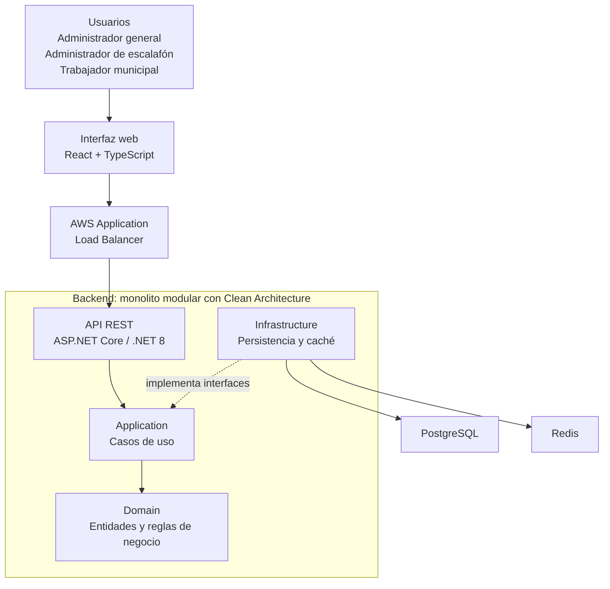

# Arquitectura inicial del sistema

## Descripción

Se propone una aplicación web para gestionar la información escalafonaria del personal municipal. La solución tendrá un frontend web y un backend organizado como monolito modular con Clean Architecture.

## Componentes principales

- **Interfaz web:** React y TypeScript.
- **Balanceador de carga:** AWS Application Load Balancer.
- **API REST:** ASP.NET Core con .NET 8.
- **Backend:** capas API, Application, Domain e Infrastructure.
- **Persistencia:** PostgreSQL.
- **Caché:** Redis.
- **Ejecución de servicios:** Docker y Docker Compose.

## Diagrama de arquitectura inicial

## Flujo general

Los usuarios acceden al sistema desde la interfaz web. Esta se comunica con la API REST a través del balanceador de carga. La API coordina los casos de uso de Application, que aplican las reglas de Domain. Infrastructure conecta el backend con PostgreSQL y Redis.

La arquitectura inicial se enfoca en el sistema escalafonario y permitirá incorporar otros módulos gradualmente.