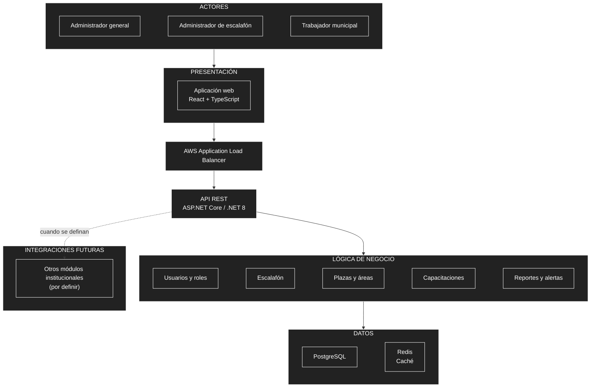

# Arquitectura inicial del sistema

## Diagrama de arquitectura

## Descripción

La arquitectura inicial organiza el sistema en presentación, lógica de negocio y datos. La interfaz web se comunica con el backend mediante una API REST. El backend se desarrollará con ASP.NET Core y .NET 8, como un monolito modular organizado con Clean Architecture.

- **Presentación:** permite que los usuarios interactúen con el sistema desde una aplicación web.
- **Lógica de negocio:** reúne los módulos de usuarios y roles, escalafón, plazas y áreas, capacitaciones, reportes y alertas.
- **Datos:** PostgreSQL almacena la información y Redis se considera para las funciones de caché.
- **Balanceo:** AWS Application Load Balancer distribuye las solicitudes hacia el backend.
- **Integraciones futuras:** se incorporarán gradualmente cuando se definan los módulos institucionales correspondientes.