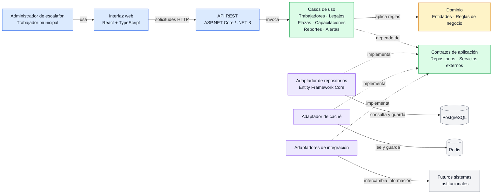

# Enfoque arquitectónico

## 1. Descripción

El Sistema de Gestión Escalafonaria Municipal utilizará **Clean Architecture** para organizar el código en capas con responsabilidades definidas. Las reglas del negocio se mantendrán separadas de la interfaz, la base de datos y otros servicios externos.

Este enfoque permitirá mantener y probar el sistema con mayor facilidad. También permitirá cambiar tecnologías externas sin modificar directamente las reglas principales del escalafón.

## 2. Patrón seleccionado

| Aspecto | Descripción |
|---|---|
| Patrón arquitectónico | Clean Architecture |
| Objetivo | Separar las reglas del negocio de los detalles técnicos y de infraestructura. |
| Problema que resuelve | Reduce el acoplamiento entre la lógica del sistema, la interfaz, la base de datos y los servicios externos. |
| Capas definidas | Presentación, Aplicación, Dominio e Infraestructura. |
| Beneficio principal | Facilita el mantenimiento, las pruebas y la evolución del Sistema de Gestión Escalafonaria Municipal. |

## 3. Capas de la arquitectura

### 3.1 Presentación

Es la capa con la que interactúan los usuarios y otros sistemas.

Incluye:

- Interfaz web desarrollada con React y TypeScript.
- API REST desarrollada con ASP.NET Core / .NET 8.
- Endpoints y middleware para recibir solicitudes, validar datos de entrada y devolver respuestas.

### 3.2 Aplicación

Coordina las operaciones que ofrece el sistema. Recibe las solicitudes de la capa de presentación y utiliza las reglas del dominio para completar cada caso de uso.

Incluye:

- Casos de uso para administrar trabajadores y sus legajos.
- Casos de uso para gestionar plazas, áreas y capacitaciones.
- Casos de uso para generar reportes y alertas.
- Interfaces o contratos que la infraestructura implementa para acceder a datos y servicios externos.

### 3.3 Dominio

Contiene las reglas centrales del negocio. Esta capa no debe depender de React, ASP.NET Core, PostgreSQL, Redis ni de otros servicios externos.

Incluye conceptos y reglas relacionados con:

- Trabajador municipal.
- Legajo y escalafón.
- Plaza y área laboral.
- Capacitación y méritos.
- Validaciones y reglas propias de la gestión escalafonaria.

### 3.4 Infraestructura

Contiene los detalles técnicos necesarios para conectar el sistema con tecnologías externas.

Incluye:

- Implementaciones para consultar y guardar información en PostgreSQL.
- Implementaciones para utilizar Redis como caché.
- Adaptadores para futuras integraciones con sistemas institucionales.
- Configuración de acceso a datos y servicios externos.

## 4. Diagrama del enfoque arquitectónico

En el diagrama, las flechas continuas representan el flujo de ejecución. Las flechas discontinuas representan dependencias de código: la infraestructura implementa contratos definidos por la aplicación.

## 5. Leyenda

- **Flecha continua:** representa una llamada o comunicación durante la ejecución del sistema.
- **Flecha discontinua:** representa una dependencia de código.
- **Flechas discontinuas desde Infraestructura:** indican que los adaptadores implementan los contratos definidos en la capa de Aplicación.
- **Capas:** Presentación, Aplicación, Dominio e Infraestructura agrupan los componentes según su responsabilidad.

## 6. Regla de dependencia

1. El **Dominio** contiene las entidades y reglas del negocio, y no depende de las capas externas ni de tecnologías específicas.
2. La **Aplicación** coordina los casos de uso y depende del Dominio y de los contratos que necesita.
3. La **Infraestructura** implementa los contratos definidos por la Aplicación para conectarse con PostgreSQL, Redis y futuros sistemas institucionales.
4. La **Presentación** recibe las solicitudes de los usuarios y las comunica a la Aplicación mediante la API.
5. Si se cambia una tecnología, como la base de datos o el servicio de caché, se actualizan principalmente los adaptadores y la configuración; las reglas del Dominio se mantienen.